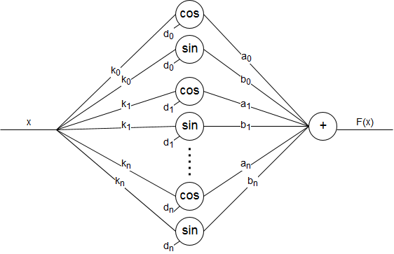

### 1. Express the network function function Φ in Figure 1.15 in terms of the primitive functions f<sub>1</sub>,...,f<sub>4</sub> and of the weights α<sub>1</sub> ,...,α<sub>5</sub>.


#### Solution:


```python
from IPython.display import Math
Math(r'\Phi(x, y, z) =  f_4(f_2(f_1(y)\alpha_1 + x)\alpha_4 + f_3(f_1(y)\alpha_2 + f_2(f_1(y)\alpha_1 + x)\alpha_3 + z)\alpha_5)')
```


$\displaystyle \Phi(x, y, z) =  f_4(f_2(f_1(y)\alpha_1 + x)\alpha_4 + f_3(f_1(y)\alpha_2 + f_2(f_1(y)\alpha_1 + x)\alpha_3 + z)\alpha_5)$


<br>
<br>
<br>
<br>

### 2. Modify the network of Figure 1.17 so that it corresponds to a finite number of addition terms of equation (1.2).


#### Solution:



<br>
<br>
<br>
<br>

### 3. Look in a neurobiology book for the full set of differential equations of the Hodgkin–Huxley model. Write a computer program that simulates an action potential.


#### Solution:

[Code](3.py)


