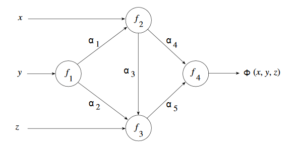
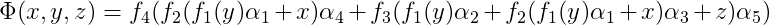
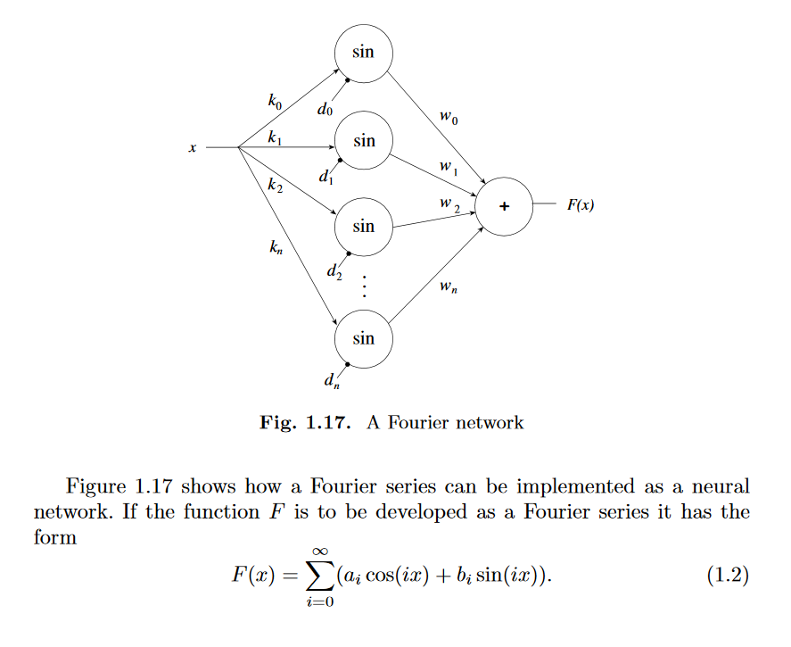
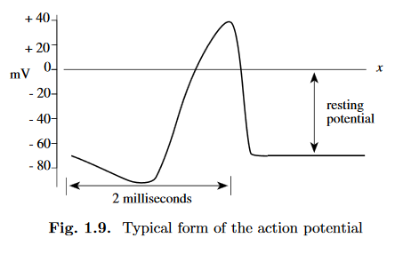
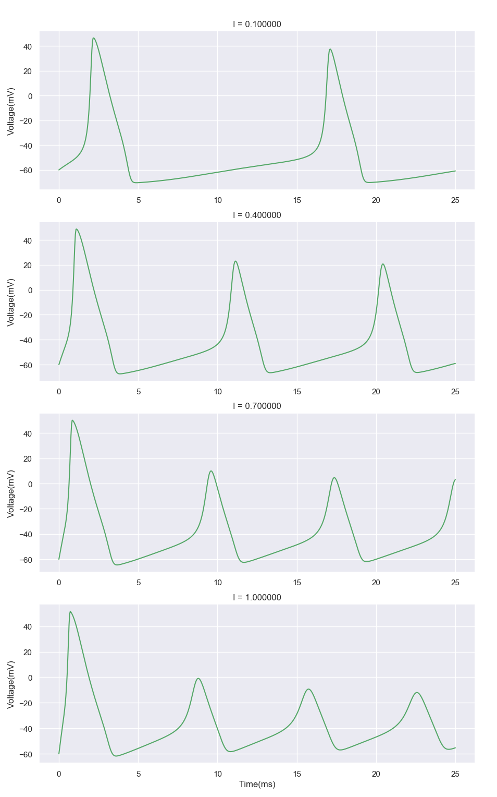

### 1. Express the network function function Φ in Figure 1.15 in terms of the primitive functions f1,...,f4 and of the weights α1 ,...,α5.

#### Solution:

 
 
 
 

### 2. Modify the network of Figure 1.17 so that it corresponds to a finite number of addition terms of equation (1.2).

#### Solution:

 
 
 
 

### 3. Look in a neurobiology book for the full set of differential equations of the Hodgkin–Huxley model. Write a computer program that simulates an action potential.

#### Solution:

[Code](3.py)

